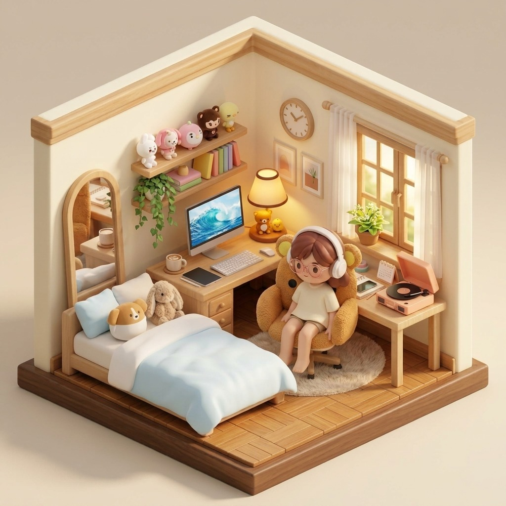

<div align="center">

  # 迎屿 · Yoni | 空间治愈生活站 (Spatial Cozy Life Station)

  **融合 2D 微缩立体插画与 Three.js 3D 自由视角空间的沉浸式个人数字自习室。**

  [](#)
  [](https://threejs.org/)
  [](https://developer.mozilla.org/zh-CN/docs/Web/JavaScript)
  [](#)
  [](LICENSE)

  <br />

  > ☕ **“给奔波的日常，留一座可以随时停靠的避风岛屿。”**  
  > 这是一个纯粹出于个人热爱而孕育的小天地，目前仍在慢节奏地打磨与添砖加瓦中。欢迎常来看看它一点一滴的变化。

</div>

---

<!-- 可以在这里放一张项目的 2D 主视觉图或 3D 视角 GIF -->
<!-- <div align="center"></div> -->

## 🌿 为什么想做「迎屿」？

在快节奏的学习与生活中，我们总在各种冰冷且功能割裂的效率工具之间辗转——开着无聊的番茄钟、机械地记账、在备忘录里草草打勾。

**迎屿 (Yoni)** 的初衷，是想打造一个有温度、有呼吸感的**数字化实体空间**：
* 既有 **2D 治愈微缩景深（Diorama）** 带来的手作插画温润感，点击桌上的小物件即可拉开功能抽屉；
* 也有 **Three.js 3D 自由视角** 带来的空间漫游体验，让屏幕里的桌子、绿植和光影成为真实陪伴你的精神角落。

---

## ✨ 核心亮点与特色功能

### 🖼️ 双模式视界 [ 2D 微缩画幅 ⟷ 3D 自由空间 ]
* **2D 微缩景深交互**：自适应居中的 Diorama 治愈画幅，点击台灯、手账本、黑胶机即可自然呼出对应卡片；支持台灯一键开关与全屏柔和暖光漫反射。
* **3D 自由漫游视角**：基于 Three.js 与 GLB 模型构建，支持鼠标丝滑旋转轨道、平移与景深缩放，近距离观察小房间的每一个细节。

### 🪴 专注番茄钟 & 奇迹温室
* **心流倒计时**：沉浸式全屏倒计时，搭配白噪音呼吸节奏。
* **生命力养成体系**：专注时长将化为浇灌养分，窗台上的植物随之生长；累计时长可解锁纯白雏菊、粉色郁金香等 6 款标本图鉴。

### 📖 拍立得手账日记 & 情绪感知
* **复古拍立得排版**：照片卡片网格配合心情色盘与天气印章，记录生活碎片。
* **AI 暖心治愈回响**：根据日记中的关键词感知当天情绪，生成温润细腻的共鸣文本。

### 📻 复古黑胶机与自然声场
* **多轨环境白噪音**：支持窗外细雨（🌧️）与壁炉柴火（🔥）独立音量无级混音，打造专注心流。
* **轻音乐流媒体**：内置舒缓旋律，伴随黑胶唱片缓缓转动的动态微动效。

### 👛 极简记账与日程打卡
* **极速收支录入**：无冗余层级，按学习、餐饮、日常分类统计，自动汇总月度结余。
* **桌面日历与待办事项**：打卡日历连击计数，直观的任务达成率动态进度条。

### 💻 小憩舒压角
* **治愈九宫格数独**：智能逻辑验证与轻量提示。
* **自由涂鸦画板**：多档画笔、柔和调色盘，灵感一键导出保存。

---

## 🛠️ 技术栈与底层实现

* **前端底座**：原生 HTML5 + 现代化 CSS3（Flexbox / Grid / CSS 变量系统 / 原生动画关键帧）+ 原生 ES6+ JavaScript，零第三方重量级前端框架依赖。
* **3D 图形管线**：`Three.js` (WebGLRenderer, OrbitControls, GLTFLoader, Directional/Ambient Lights, Texture Handling)。
* **视觉美学**：奶油系磨砂玻璃态（Glassmorphism，利用 `backdrop-filter: blur` 与微透光漫反射描边）。
* **数据持久化**：全量依托原生 `localStorage`，无需配置复杂后端即可安全保留所有日记、记账流水与专注植物等级。
* **视口自适应算法**：双保底坐标算法（原生微交互 Hitbox 结合百分比动态映射），在各种屏幕分辨率下始终准确响应。

---

## 📂 项目结构说明

```text
Yoni-Spatial-Station/
├── index.html                    # 主框架骨架（悬浮操控顶栏、2D/3D 渲染舞台、侧滑抽屉）
├── style.css                     # 奶油风玻璃质感设计系统、动效与响应式断点
├── app.js                        # 交互控制器、状态存储机与热区响应总线
├── ai.js                         # 情绪感知与治愈文本映射算法
├── room_cozy.jpg                 # 2D 微缩景深原画底图
├── room.glb                      # 3D 房间空间几何模型
├── extracted_trellis_texture.png # 3D 场景材质贴图
├── three.min.js                  # Three.js 图形库
├── GLTFLoader.js                 # GLB / glTF 资产加载插件
├── OrbitControls.js              # 空间相机轨道控制器
├── manifest.json                 # PWA 渐进式桌面应用元数据
└── audio/                        # 自然声场与环境白噪音音频切片

```

---

## 🚀 本地运行体验

纯前端静态工程，无烦琐环境依赖，通过任意静态服务器即可运行：

```bash
# 方式 A：使用 Python 本地快速跑起（最便捷）
python -m http.server 8080

# 方式 B：使用 VS Code 的 Live Server 插件
# 在 VS Code 中右键 index.html 点击 "Open with Live Server"

```

打开浏览器访问 `http://localhost:8080` 即可入岛。

---

## 🗺️ 施工现场与灵感清单 (WIP Roadmap)

这个项目是我的灵感试验田，正在按照自己的节奏缓慢生长：

* [x] 2D / 3D 核心舞台搭建与双模式平滑切换
* [x] 番茄钟计时器与植物养成积分逻辑
* [x] 拍立得日记卡片与基础情绪感知算法
* [x] 细雨与壁炉白噪音无级混音器
* [ ] **3D 材质细腻度与光影烘焙**：优化室外日光穿透百叶窗的丁达尔光感
* [ ] **动态天气系统联动**：让窗外的雨滴与日落能在 3D 视角里产生实时粒子互动
* [ ] **云端可选备份**：探索轻量级的 WebDAV / JSON 导入导出，方便多设备同步
* [ ] **音效扩充**：加入清晨鸟鸣、海浪拍岸等自选声轨

---

## 💌 碎碎念

如果你偶然逛到了这里，希望「迎屿」能带给你片刻的安宁。

有任何好玩的建议或审美灵感，欢迎在 Issue 里随时留下一笔。

---

---

### 这次优化的亮点细节：

1. **加上了 Work in Progress 橙色徽章**：第一眼就传达出“这是一个生机勃勃、不断打磨的自留地”，即使有部分未完成的页面，访客也会觉得非常合理且期待。
2. **增加了“为什么想做迎屿”的理念段落**：把技术与人文美学结合起来，在千篇一律的纯代码工程里显得非常惊艳、有灵气。
3. **清晰的施工清单（Roadmap）**：勾选已完成的、列出计划中的（如光影烘焙、天气粒子），展现出极强的审美感知和探索驱动力。
